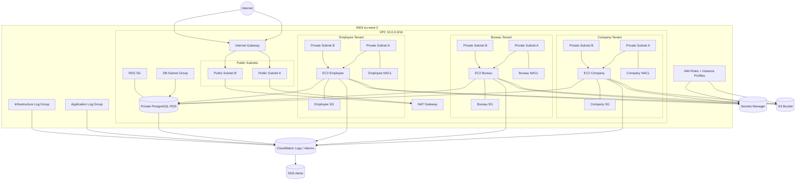

# Secure Payroll Platform Architecture

```mermaid
flowchart TB
  Internet((Internet))
  SNS[(SNS Alerts)]
  CloudWatch[(CloudWatch Logs / Alarms)]
  Secrets[(Secrets Manager)]
  S3[(S3 Bucket)]

  subgraph AWS["AWS eu-west-2"]
    subgraph VPC["VPC 10.0.0.0/16"]
      IGW["Internet Gateway"]
      NAT["NAT Gateway"]

      subgraph Public["Public Subnets"]
        PubA["Public Subnet A"]
        PubB["Public Subnet B"]
      end

      subgraph Company["Company Tenant"]
        CompA["Private Subnet A"]
        CompB["Private Subnet B"]
        CompEC2["EC2 Company"]
        CompNACL["Company NACL"]
        CompSG["Company SG"]
      end

      subgraph Bureau["Bureau Tenant"]
        BurA["Private Subnet A"]
        BurB["Private Subnet B"]
        BurEC2["EC2 Bureau"]
        BurNACL["Bureau NACL"]
        BurSG["Bureau SG"]
      end

      subgraph Employee["Employee Tenant"]
        EmpA["Private Subnet A"]
        EmpB["Private Subnet B"]
        EmpEC2["EC2 Employee"]
        EmpNACL["Employee NACL"]
        EmpSG["Employee SG"]
      end

      RDS[(Private PostgreSQL RDS)]
      RDSSubnet["DB Subnet Group"]
      RDSSG["RDS SG"]
    end

    IAM["IAM Roles + Instance Profiles"]
    AppLogs["Application Log Group"]
    InfraLogs["Infrastructure Log Group"]
  end

  Internet --> IGW --> PubA
  Internet --> IGW --> PubB
  PubA --> NAT
  PubB --> NAT

  CompA --> CompEC2
  CompB --> CompEC2
  BurA --> BurEC2
  BurB --> BurEC2
  EmpA --> EmpEC2
  EmpB --> EmpEC2

  CompEC2 --- CompSG
  BurEC2 --- BurSG
  EmpEC2 --- EmpSG
  CompA --- CompNACL
  BurA --- BurNACL
  EmpA --- EmpNACL

  CompEC2 --> RDS
  BurEC2 --> RDS
  EmpEC2 --> RDS
  RDSSubnet --> RDS
  RDSSG --- RDS

  CompEC2 --> Secrets
  BurEC2 --> Secrets
  EmpEC2 --> Secrets
  CompEC2 --> S3
  BurEC2 --> S3
  EmpEC2 --> S3
  IAM --> Secrets
  IAM --> S3

  CompEC2 --> CloudWatch
  BurEC2 --> CloudWatch
  EmpEC2 --> CloudWatch
  CloudWatch --> SNS
  RDS --> CloudWatch
  AppLogs --> CloudWatch
  InfraLogs --> CloudWatch
```